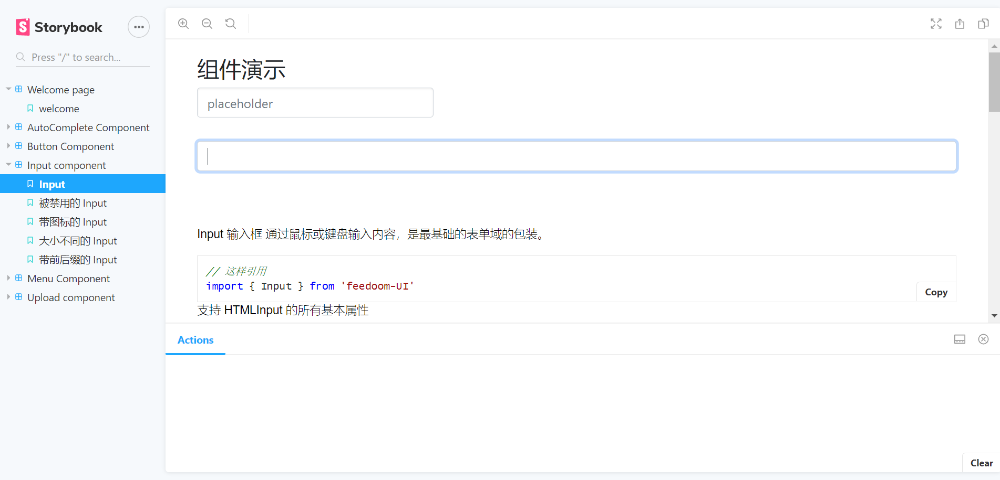

## feedoom-ui component library

## 使用 React+typescript 打造的组件库

### 组件预览

[组件预览地址](https://feedoom.gitee.io/feedoom-ui)


### 安装最后已经发布的组件库来试试

```javascript
npm install feedoom-ui --save
```

### 使用

```javascript
// 加载样式
import "feedoom-ui/dist/index.css";
// 引入组件
import { Button } from "feedoom-ui";
```

### 一些本地开发命令

```bash
//启动本地环境
npm run stroybook

//跑单元测试
npm test
```
